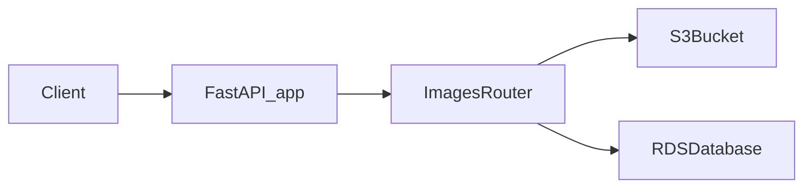

## Image API Extension Plan

### High-level approach

- **Goal**: Extend the existing FastAPI app in `[main.py](/Users/sergei_shabalov/github/aws-dummy-backend/main.py)` to support image upload/download and metadata operations, persisting metadata in AWS RDS and storing image binaries in AWS S3.
- **Assumptions**: RDS is configured for a relational engine (e.g., PostgreSQL or MySQL) and connection details, S3 bucket name, and AWS credentials will be provided via environment variables.

### Architecture & data flow

- **New components**:
  - **Database layer**: SQLAlchemy models and session management for an `images` table representing image metadata.
  - **S3 client layer**: A thin wrapper around `boto3` S3 client for upload, download, and delete operations.
  - **Image router**: A FastAPI router with endpoints for image operations, mounted into the main app.
- **Data model** (RDS `images` table):
  - `id` (PK, UUID or integer autoincrement)
  - `name` (string, unique, used as API identifier)
  - `size_bytes` (integer)
  - `extension` (string, e.g., `jpg`, `png`)
  - `last_updated_at` (timestamp, defaults to `NOW()` and updated on change)
  - `s3_key` (string, S3 object key – can be derived from `name` and `extension` but stored explicitly for flexibility).

### Dependencies & configuration

- **Update `pyproject.toml**` at `[pyproject.toml](/Users/sergei_shabalov/github/aws-dummy-backend/pyproject.toml)`:
  - **Add runtime deps**: `boto3`, `SQLAlchemy` (2.x), and a DB driver (e.g., `asyncpg` for PostgreSQL or `aiomysql` / `pymysql` for MySQL).
  - (Optional) Add `alembic` if schema migrations are desired, though for this simple app we can manage the single `images` table with a one-time DDL script.
- **Environment/config variables** (read via `os.getenv` or similar):
  - `DB_URL` (SQLAlchemy connection string for RDS)
  - `AWS_REGION`
  - `AWS_S3_BUCKET`
  - Optional: `AWS_ACCESS_KEY_ID`, `AWS_SECRET_ACCESS_KEY` if not relying on instance profile / IAM role.

### Code organization

- **New modules** (all under the project root package):
  - `[db.py](/Users/sergei_shabalov/github/aws-dummy-backend/db.py)`:
    - Create SQLAlchemy engine and session factory targeting RDS using `DB_URL`.
    - Define `Base` and the `Image` ORM model with fields described above.
    - Provide dependency helpers for FastAPI (e.g., `get_session`) using async sessions (or sync sessions in a threadpool if preferred).
  - `[s3_client.py](/Users/sergei_shabalov/github/aws-dummy-backend/s3_client.py)`:
    - Initialize a `boto3` S3 client with region and bucket from environment.
    - Helper functions: `upload_image(file_obj, key, content_type)`, `download_image(key)`, `delete_image(key)`, and `generate_s3_key(name, extension)`.
  - `[routers/images.py](/Users/sergei_shabalov/github/aws-dummy-backend/routers/images.py)`:
    - Define a FastAPI `APIRouter` with the image endpoints.
    - Pydantic response models for metadata outputs.
- **Update `main.py**`:
  - Import and include the new `images` router with a prefix like `/images` (e.g., `app.include_router(images_router, prefix="/images", tags=["images"])`).

### API design

- **Download image by name**
  - **Endpoint**: `GET /images/{name}`
  - **Behavior**:
    - Look up the image in RDS by `name`; if not found, return `404`.
    - Resolve `s3_key` (from the DB record) and fetch the object from S3.
    - Return as `StreamingResponse` with appropriate `Content-Type` (derive from `extension` or S3 object metadata) and `Content-Disposition` for download.
- **Show metadata for existing image by name**
  - **Endpoint**: `GET /images/{name}/metadata` or `GET /images/{name}` with `?metadataOnly=true` (prefer the dedicated `/metadata` path for clarity).
  - **Response**:
    - JSON object containing: `name`, `size_bytes`, `extension`, `last_updated_at`.
- **Show metadata for a random image**
  - **Endpoint**: `GET /images/random/metadata`
  - **Behavior**:
    - Query RDS for a random row (e.g., via `ORDER BY RANDOM() LIMIT 1` for PostgreSQL or `ORDER BY RAND()` for MySQL, or by selecting a random offset based on `COUNT(*)`).
    - Return the same metadata JSON shape as above.
    - If no images exist, return `404` or a clear `204`-like response.
- **Upload an image**
  - **Endpoint**: `POST /images`
  - **Request**:
    - `multipart/form-data` with fields: `file` (binary upload) and optional `name` (if omitted, derive from filename without extension).
  - **Behavior**:
    - Read the uploaded file into a stream, inspect filename for extension, and determine size (stream to S3 while counting bytes or buffer to memory/disk, depending on expected sizes).
    - Construct `s3_key` (e.g., `images/{name}.{extension}`) and upload to S3.
    - Upsert RDS row:
      - If `name` does not exist, insert a new record with `last_updated_at` set to current time.
      - If `name` exists, update `size_bytes`, `extension`, `s3_key`, and `last_updated_at`.
    - Return uploaded image metadata as JSON.
- **Delete an image by name**
  - **Endpoint**: `DELETE /images/{name}`
  - **Behavior**:
    - Look up the image in RDS by `name`; if not found, return `404`.
    - Delete the corresponding object from S3 using `s3_key`.
    - Delete the metadata row from RDS.
    - Return a simple confirmation payload (e.g., `{ "name": "...", "deleted": true }`).

### Error handling & edge cases

- **Not found**: Return `404` for missing images (both metadata and binary).
- **Name collisions**: On upload, either treat as update (upsert behavior) or reject with `409`; this plan assumes **update/overwrite** semantics for simplicity.
- **Invalid file types**: Optionally validate extensions against an allowed list (e.g., `jpg`, `jpeg`, `png`, `gif`); return `400` if disallowed.
- **Database/S3 failures**: Map lower-level exceptions to `5xx` errors with safe, generic messages while logging underlying issues.

### AWS integration details

- **RDS**:
  - Use a single connection URL (`DB_URL`) so the app can point to any RDS engine supported by SQLAlchemy.
  - Ensure connection pooling is configured with sane defaults for FastAPI.
  - Provide a simple one-time migration or initialization script for creating the `images` table if it does not exist.
- **S3**:
  - Use `boto3.client("s3")` with region from `AWS_REGION`.
  - Allow IAM roles/instance profiles to supply credentials in production; support explicit keys for local/dev.
  - Consider using `ContentType` and basic metadata (e.g., `x-amz-meta-name`) to store the original name if useful.

### Testing & validation

- **Local testing**:
  - Optionally support `localstack` or a test S3 bucket and non-production RDS instance.
  - Add basic tests for each endpoint using FastAPI's `TestClient`, mocking S3 and DB where appropriate.
- **CI impact**:
  - The existing GitHub Actions workflow in `[.github/workflows/build_artifact.yaml](/Users/sergei_shabalov/github/aws-dummy-backend/.github/workflows/build_artifact.yaml)` should continue to work as-is; no changes are strictly required, but optional test steps could be added later.

